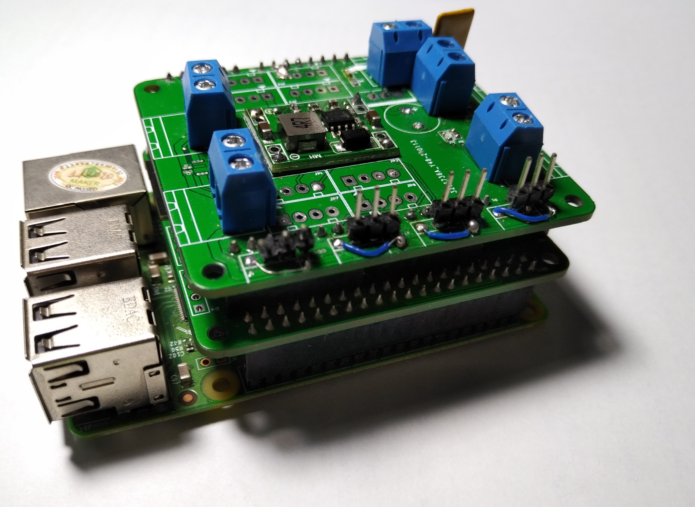
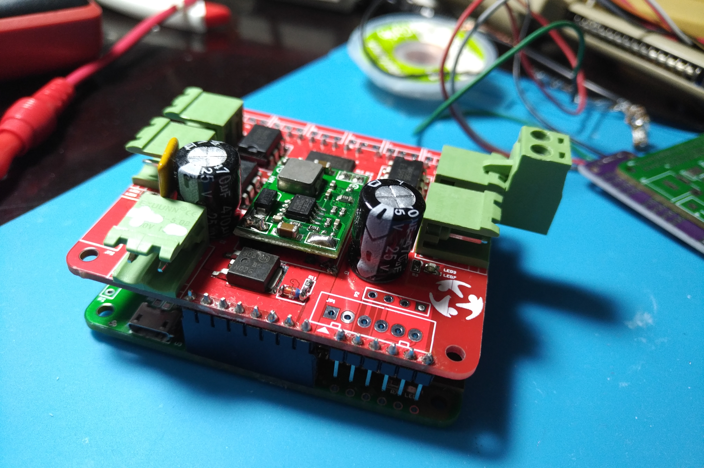

# Lưu ý đặc biệt dành cho thí sinh và Mentor của  cuộc thi VRC 2022
Qua 24h gửi mạch cho các đội (17h 16/5/2022), ban bảo trợ chuyên môn MakerViet đã nhận được thông tin **11/50** mạch đã bị hư hỏng do sai sót trong quá trình sử dụng của không chỉ các bạn thí sinh mà còn của các Mentor trực tiếp hướng dẫn các đội

Mặc dù Ban bảo trợ chuyên môn đã lưu ý rõ về những điều không được làm trong quá trình sử dụng mạch makerBot BANHMI, không dưới 3 lần trong quá trình đào tạo, những lưu ý này cũng được in rõ ở trang nhất của tài liệu, nhưng sự cố vẫn xảy ra tương đối nhiều khi các bạn sử dụng

Vậy nên dưới đây là lưu ý chi tiết về những việc thí sinh và mentor **TUYỆT ĐỐI KHÔNG ĐƯỢC LÀM** khi sử dụng mạch **Makerbot BANHMI**.

## Cắm cổng sạc pin 4 chân vào header I2C

**- Mức độ nghiêm trọng:** **Cực kì nghiêm trọng** 

**- Thời gian sửa chữa:** **2-4 tuần**  _(do tình trạng thiếu chip đang diễn ra trên toàn cầu)_ 

**- Nguyên nhân :** _cắm chân sạc pin vào chaan header I2C của mạch makerbot_ 

 Header màu tráng (2 header, 1 trên mạch điều khiển, 1 trên mạch công suât) được thiết kế để cắm cảm biến, và các thiết bị điều khiển qua giao thức I2C.
    

Khi cắm chân sạc pin vào cổng này, điện áp từ pin sẽ dội ngược không chỉ vào các linh kiện sử dụng giao thức I2C mà còn ở các bị chạy trên lưới 3.3V

=> Hỏng gần như toàn các thiết bị active, IC trên cả 2 mạch công suất và mạch điều khiển
 

 **- Cách nhận biết:** 

    - Mạch không hoạt động, cắm máy tính không nhận
    - Mạch điều khiển không sáng đèn 
    - Đường 3.3V bị chập xuống GND

 **- Phương pháp sửa chữa:** thay thế những linh kiện sau:

    Trên mạch điều khiển: 
    - ESP32-WROVER-E 16Mb
    - CP2102
    - DS1307
    - MPU6050
    - AP2102 (có thể không cần thay)

    Trên mạch công suất:
    - PCA9685

## Cắm pin vào cổng động cơ
 **- Mức độ nghiêm trọng:**  **Nghiêm trọng** 

 **- Thời gian sửa chữa:** **1-2 tuần**  _(do tình trạng thiếu chip đang diễn ra trên toàn cầu)_ 

 **- Nguyên nhân :** _Cắm pin vào cổng động cơ làm cháy IC cầu H_

Việc cắm pin vào chân đièu khiển động cơ, khiến dòng 12V từ pin chạy ngược vào cầu H, đánh thủng Fet bên trong cầu H, dẫn tới cháy IC cầu H
 

 **- Cách nhận biết:** _IC cầu H bị cháy, nổ, kênh động cơ đó không hoạt động_

 **- Phương pháp sửa chữa**: 
 
&nbsp;&nbsp;Thay thế những linh kiện sau: 

    Trên mạch công suât: 
    - IC cầu H TA6586

# Makerbot 

## Giới thiệu
Makerbot là bo mạch phát triển phần cứng do MakerViet phát triển với mục đích phục vụ cho các dự án xe tự hành và Robotics của các bạn trẻ Việt Nam.\
Các dự án sử dụng nền tảng Makerbot:
- Vietnam Autonomus (VIA): dự án xe tự hành mã nguồn mở, chi phí thấp. [Tìm hiểu thêm](https://github.com/makerhanoi/via-course-makerbot)
- Vietnam Robotic Challenge (VRC 2022): cuộc thi Robotic cho các bạn học sinh cấp 3
## Hướng dẫn sử dụng
### Phần mềm (firmware)
Mạch Makerbot sử dụng ESP32 với Arduino Framework, để phát triển với mạch, có thẻ sử dụng Arduino IDE hoặc Platform IO \
Trong Repo này có 2 ví dụ mẫu để làm quen với mạch Makerbot, về điều khiển động cơ và sử dụng với tay cầm PS2. Thông tin chi tiết 
### Phần cứng (hardware)
## Các phiên bản Makerbot
_sẽ cập nhật sau_

## Software: Firmware example.
## Docs: Documents.
Website: https://makerviet.org/

<!-- **Note this design should not be used as refrence since it's still under active development and testing process**
Makerbot is an open-source hardware platform focus on robotics and self-driving vehicle featuring WiFI, BLE, 9 DOF IMU, CAN, RS485, upto 6 Servos and 4 DC motors drive

## Hardware: PCB and 3D design files.
### Specs:
- ESP32-WROVER-IE(16MB)
- MPU-9250,9 DOF IMU
- SN65HVD230 CAN transceiver 
- MAX3485
- PCA9685 16 channel PWM driver
- DRV8841 H-Bridge
- DS3231MZ+ RTC
### Known issues
- WiFI signal strength issue 
- Pull up resistor on IO2 causing ESP32 cannot reset properly , Do not populate R15
- Rs485 issue
- cannot read magnetometer MPU9250
- Motorshield power issue
### Todos:
- Redesign motorshield 
- Add pins name to Silkscreen
- Fix known issues in next revision -->

