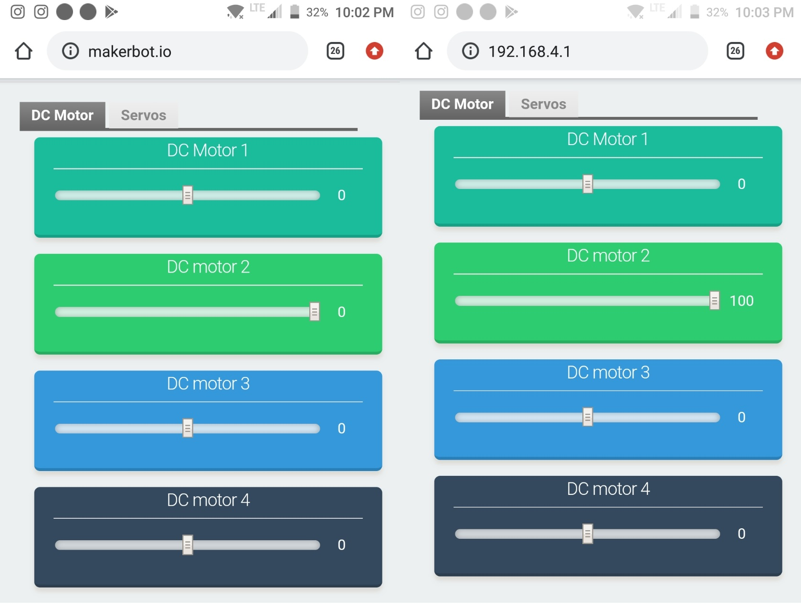
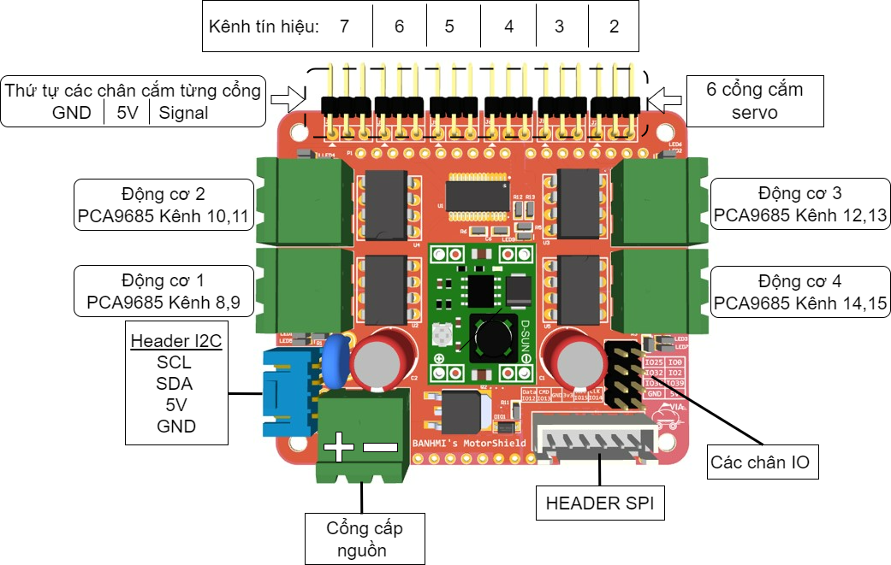
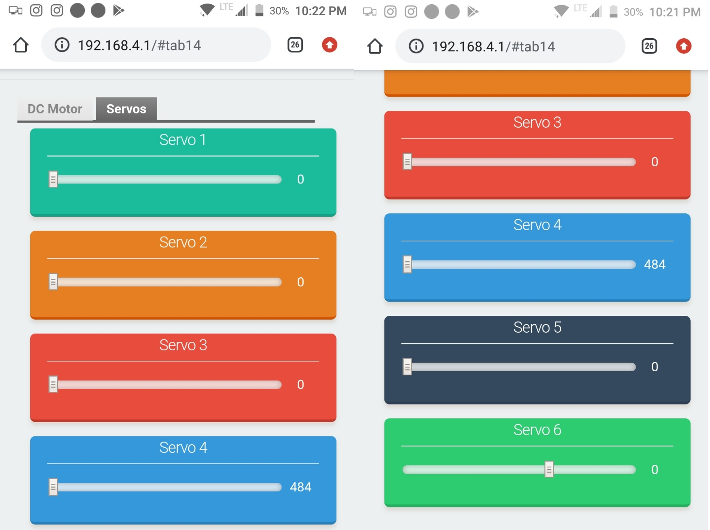
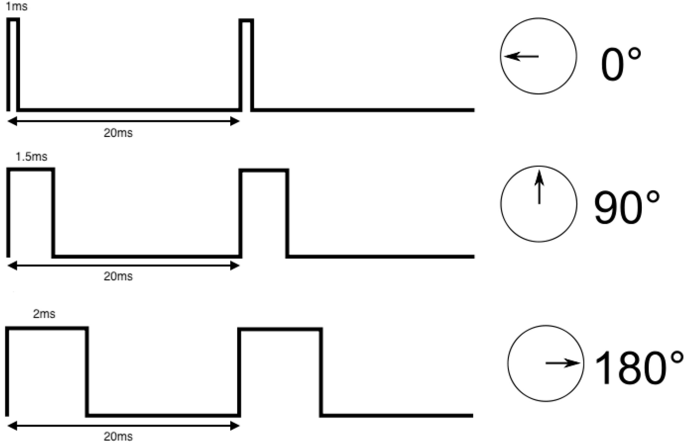

# Hướng dẫn sử dụng các chương trình mẫu
## Giới thiệu 
Trên đây là những ví dụ đề kiểm tra, thử nghiệm các tính năng hoạt động của mạch VIA, bao gồm:
- Maker_bot_motor_test: ví dụ điều khiển động cơ DC và Servo
- MakerbotwPS2: ví dụ điều khiển động cơ DC bằng tay cầm PS2

## Cài đặt trình biên dịch
### Sử dụng Arduino IDE
Các bạn có thể download và cài đặt Arduino IDE [tại đây](https://www.arduino.cc/en/software)

Cài đặt ESP32 trên Arduino, hướng dẫn [tại đây](../docs/Tutorial_Docs/Cài-đặt-thư-viện-ESP32-trên-Arduino-IDE.pdf) 

### Sử dụng Platform IO
Để sử dụng Platform IO các bạn cần 1 code editor, chúng tôi khuyến nghị sử dụng VScode, có thể tải [tại đây](https://github.com/anhtu0310/Makerbot_motor_test).

Ngoài ra các bạn có thể tìm thấy ví dụ này trên PlatformIO với đầy đủ thư viện  [tại đây](https://code.visualstudio.com/download). 

## Cài đặt các thư viện cần thiết
Để tiện lợi cho tất cả mọi người, chúng tôi đã tổng hợp toàn bộ các thư viện cần thiết để sử dụng các chương trình mẫu, bạn có thể tải về [tại đây](https://rogosmart-my.sharepoint.com/:u:/g/personal/tu_danganh_rogo_com_vn/ESJKm2XPhw9Hl89-lLPU8d4B54ctBPSGGFCmoeG4xCfOxw?e=gbFQdg)  

Sau khi tải về file trên, bạn tiến hành cài đặt bằng cách giải nén file nén tới Thư mục: **Document > Arduino > libraries** 

 

Ngoài ra các bạn có thể cài theo cách thủ công từng thư viện, dưới đây là chi tiết các thư viện cần thiết để chạy các chương trình ví dụ trên.

- **Thư viện Adafruit PCA9685**: Thư viện PWM cho PCA9685, [link](https://github.com/adafruit/Adafruit-PWM-Servo-Driver-Library)
- **Thư viện tay PS2** : Sử dụng tay cầm PS2 với Makerbot [link](https://github.com/makerhanoi/Arduino-PS2X-ESP32-Makerbot)
- **Thư viện ESPUI** : sử dụng tạo giao diện webserver [link](https://github.com/s00500/ESPUI)
- **Thư viện AsyncTCP cho ESP32** : Thư viện đi kèm ESPUI [link](https://github.com/me-no-dev/AsyncTCP)
- **Thư viện Async Webserver cho ESP32** : Thư viện đi kèm ESPUI [link](https://github.com/me-no-dev/ESPAsyncWebServer)
- **Thư viện LITTLEFS cho ESP32** : Thư viện đi kèm ESPUI [link](https://github.com/lorol/LITTLEFS)
- **Thư viện ArduinoJson** : Thư viện đi kèm ESPUI [link](https://github.com/bblanchon/ArduinoJson)

## Sử dụng chương trình mẫu Maker_bot_motor_test
Sau khi nạp chương trình mẫu này, mạch VIA sẽ phát ra một WIFI Access point tên là **"Makerbot BANHMI 01"**

Hai chữ số cuối của tên Access point có thể được thay đổi (bằng cách tùy biến trong code) để tránh nhầm lẫn giữa mạch của các đội thi với nhau.

 
<!--  -->

Kết nối với WiFi AP này không yêu cầu mật khẩu. 

Sau khi kết nối với Wifi, ta sử dụng trình duyệt web truy cập vào địa chỉ **192.168.1.1** hoặc **makerbot.io** để vào giao diện điều khiển động cơ.

**_Lưu ý:_** _mạch công suất VIA (motorshield) bản 12V (dành cho các cuộc thi như VRC) cần phải được cấp nguồn điện 12V từ Pin Lipo hoặc adapter để có thể điều khiển được động cơ_

 

Trên giao diện chính có 2 tab **DC motor** và **Servo** 
#### **Tab DC motor**
Trong tab này có 4 thanh kéo như hình trên,tương ứng với 4 động cơ với số thứ tự từ 1-4

Điểm chính giữa thanh kéo là điểm số 0, tức động cơ không quay. Thanh kéo có giá trị chạy từ **-100 tới 100** tương ứng % tốc độ quay của động cơ DC.

Khi kéo thanh kéo về phía tay phải, động cơ quay theo chiều một chiều, đèn màu đỏ ở cổng động cơ sáng, giá trị thanh kéo càng lớn, đền càng sáng, động cơ càng quay nhanh.

Tương tự khi kéo thanh kéo về phía tay trái động cơ quay theo chiều ngược lại, đèn màu xamh ở cổng động cơ sáng, giá trị thanh kéo càng nhỏ, đền càng sáng, động cơ càng quay nhanh.

#### **Tab Servo**

Ở tab Servo ta nhận thấy có 6 thanh kéo, tương ứng với 6 cổng Servo, với giá trị từ **400-2200 ns** tương ứng với thời gian bật hay dutycycle của xung PWM 

Các khi kéo các thanh kéo này góc quay của servo sẽ thay đổi tùy thuộc vào loại servo đang được sử dụng, tương ứng với hình dưới. 

**_Lưu ý_**: _thông số của các động cơ servo có thể khác nhau một chút mặc dù cùng là một loại servo, vậy nên khi làm Robot các bạn cần lưu ý căn chỉnh các động cơ sao cho có thể hoạt động được chính xác nhất với yêu cầu mong muốn._

**Tổng kết** : với ví dụ này các bạn có thể kiểm tra được các chức năng điều khiển động cơ của mạch **Makerbot BANHMI** có hoạt động chính. Ngoài ra ta cũng có thể sử dụng hương trình mẫu này để kiểm tra các loại động cơ đi kèm trong bộ kit K12 Maker !

## Sử dụng chương trình mẫu MakerbotwPS2
Chương trình mẫu này cho phép chúng ta thực hiện việc điều khiển động cơ tại cổng động cơ 8 và 9 với gamepad PS2.

Bạn có thể thử lắp một bộ khung xe robot đơn giản và thử nghiệm điều khiển robot bằng gamepad PS2 với chương trình mẫu này nhé!

Tham khảo bài viết sau để biết cách kết nối gamepad với mạch VIA: [Sử dụng gamepad với mạch VIA](https://via.makerviet.org/vi/docs/3_robotics-with-via/4_gamepad-with-via/)